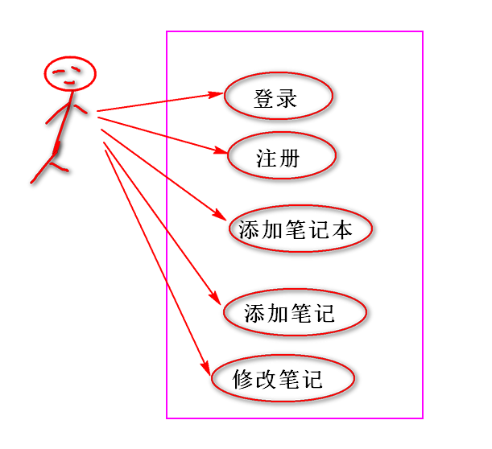
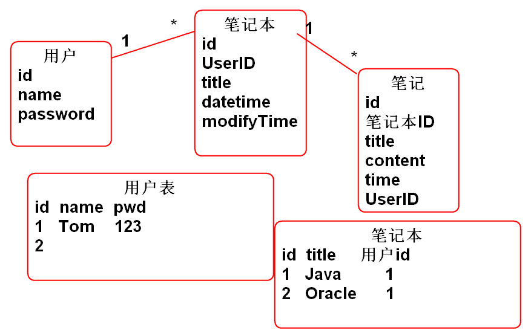
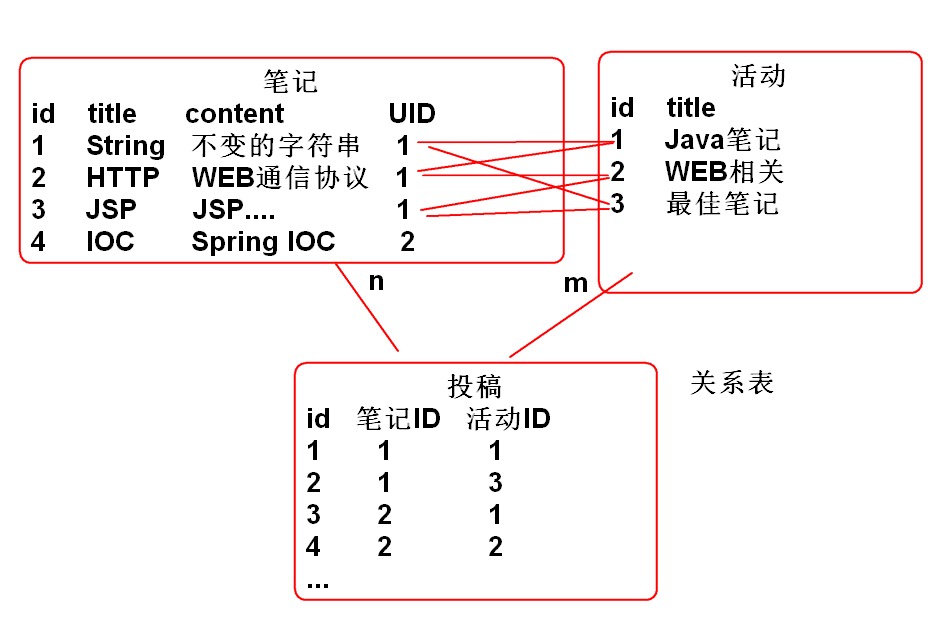
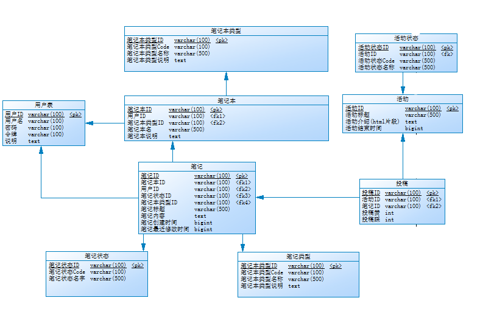

# 云笔记

## 业务需求描述

## 业务分析

找出软件中的业务实体(找对象)

用户
笔记本
笔记

## 数据库设计

利用实体关系(ER)设计工具: ER-WIN  PowerDesigner  ER-Studio ...

## 功能设计思路

程序 = 数据结构+算法

1. 搞清楚数据的结构, 数据是如何存储的.
2. 根据数据结构和软件功能设计计算过程步骤.
3. 分解计算过程到软件的每个层次
	- 界面层
	- 业务层
	- 数据持久层

如: 设计登录功能:

## 环境搭建

### 创建项目配置Spring MVC:

1. 创建Maven项目导入 相关的包 pom.xml:

		<dependency>
		  <groupId>org.springframework</groupId>
		  <artifactId>spring-webmvc</artifactId>
		  <version>3.2.8.RELEASE</version>
		</dependency>
			<dependency>
		  <groupId>com.fasterxml.jackson.core</groupId>
		  <artifactId>jackson-databind</artifactId>
		  <version>2.5.0</version>
		</dependency>
		<dependency>
		  <groupId>com.fasterxml.jackson.core</groupId>
		  <artifactId>jackson-annotations</artifactId>
		  <version>2.5.0</version>
		</dependency>
			<dependency>
				<groupId>org.mybatis</groupId>
				<artifactId>mybatis</artifactId>
				<version>3.2.8</version>
		</dependency>
		<dependency>
		  <groupId>mysql</groupId>
		  <artifactId>mysql-connector-java</artifactId>
		  <version>5.1.2</version>
		</dependency>
		<dependency>
		  <groupId>commons-dbcp</groupId>
		  <artifactId>commons-dbcp</artifactId>
		  <version>1.4</version>
		</dependency>
		<dependency>
		  <groupId>org.mybatis</groupId>
		  <artifactId>mybatis-spring</artifactId>
		  <version>1.2.4</version>
		</dependency>	
		<dependency>
		  <groupId>org.springframework</groupId>
		  <artifactId>spring-jdbc</artifactId>
		  <version>3.2.8.RELEASE</version>
		</dependency>
		<dependency>
			<groupId>junit</groupId>
			<artifactId>junit</artifactId>
			<version>4.12</version>
		</dependency>

2. 配置Spring MVC, web.xml

		<servlet>
			<servlet-name>DispatcherServlet</servlet-name>
			<servlet-class>org.springframework.web.servlet.DispatcherServlet</servlet-class>
			<init-param>
				<description></description>
				<param-name>contextConfigLocation</param-name>
				<param-value>classpath:conf/spring-*.xml</param-value>
			</init-param>
			<load-on-startup>1</load-on-startup>
		</servlet>
		<servlet-mapping>
			<servlet-name>DispatcherServlet</servlet-name>
			<url-pattern>*.do</url-pattern>
		</servlet-mapping>

3. 添加Spring配置文件 conf/spring-web.xml:

		<!-- 配置组件扫描 -->
		<context:component-scan 	base-package="cn.tedu.note.web"/>
		<!-- annotation-driven:注解驱动的MVC	@RequestMapping -->
		<mvc:annotation-driven/>

4. 部署测试 ...

### 配置MyBatis

1. 添加数据库连接参数文件: conf/db.properties:

		# conf/db.properties
		driver=com.mysql.jdbc.Driver
		url=jdbc:mysql://localhost:3306/cloud_note
		username=root
		password=root 

2. 添加配置文件conf/spring-mybatis.xml

		<!-- 导入数据库参数 db.properties -->
		<util:properties id="db" location="classpath:conf/db.properties"/> 
		<!-- 配置数据库连接池dbcp -->
		<bean id="dataSource"
			class="org.apache.commons.dbcp.BasicDataSource">
			<property name="driverClassName" value="#{db.driver}"/>
			<property name="url" value="#{db.url}"/>
			<property name="username" value="#{db.username}"/>
			<property name="password" value="#{db.password}"/>
		</bean>

3. 编写测试案例测试数据库连接:

		public class BaseTestCase {
			protected ClassPathXmlApplicationContext ctx;
			//初始化 Spring容器
			@Before 
			public void init(){
				ctx=new ClassPathXmlApplicationContext(
						"conf/spring-web.xml",
						"conf/spring-mybatis.xml");
			}
		}

		/**
		 * 测试数据库连接 
		 */
		public class JdbcTestCase 
			extends BaseTestCase{
		
			@Test
			public void testDataSource() 
					throws Exception {
				DataSource ds = ctx.getBean(
					"dataSource", DataSource.class);
				Connection conn = ds.getConnection();
				DatabaseMetaData md=conn.getMetaData();
				System.out.println(md);
				//查询数据库版本
				String n = md.getDatabaseProductName();
				String v = md.getDatabaseProductVersion();
				System.out.println(n+v); 
				conn.close();
			}
		}

4. 测试...

5. 配置MyBatis, conf/spring-mybatis.xml:

	<!-- 配置MyBatis SqlSessionFactory -->
	<bean id="sqlSessionFactory"
		class="org.mybatis.spring.SqlSessionFactoryBean">
		<property name="dataSource"
			ref="dataSource"/>
		
		<property name="mapperLocations"
			value="classpath:mappers/*.xml"/>
			
	</bean>
	<!-- Mapper 接口扫描器 -->
	<bean class="org.mybatis.spring.mapper.MapperScannerConfigurer">
		<!-- 
		<property name="sqlSessionFactory"
			ref="sqlSessionFactory"></property>
		-->
		<property name="basePackage"
			value="cn.tedu.note.dao"></property>
	</bean>

## 登录功能

### 添加数据持久层

1. 添加数据持久层UserDao.java
	
		/**
		 * 用户信息访问层 
		 */
		public interface UserDao {
			/**
			 * 根据用户名查找用户信息
			 * @param name 用户名
			 * @return 如果找到返回用户信息,否正确返回null 
			 */
			User findUserByName(String name);
			
		}

2. 利用MyBatis实现持久层 mappers/UserMapper.xml

		<mapper namespace="cn.tedu.note.dao.UserDao">
			<select id="findUserByName"
				parameterType="string" 
				resultType="cn.tedu.note.entity.User">
				select 
					cn_user_id as id,
					cn_user_name as name,
					cn_user_password as password,
					cn_user_token as token,
					cn_user_nick as nick
				from
					cn_user
				where
					cn_user_name = #{name}
			</select>
		</mapper>	

3. 测试

	public class UserDaoTestCase 
		extends BaseTestCase{
		
		@Test 
		public void testFindUserByName(){
			String name="zhoujia";
			UserDao dao = ctx.getBean(
					"userDao", UserDao.class);
			User user=dao.findUserByName(name);
			System.out.println(user);
		}
	}

> 提示: 更新数据用于测试:

		update cn_user set cn_user_password='123' where cn_user_name='zhoujia';

### 添加业务层

1. 添加业务层接口 UserService.java

		public interface UserService {
			/**
			 * 登录功能 
			 * @param name 用户输入的用户名
			 * @param password 用户输入的密码
			 * @return 如果登录成功返回用户信息
			 * @throws NameException 用户名错误
			 * @throws PasswordException 密码错误
			 */
			User login(String name, String password)
				throws NameException, PasswordException;
		}	

2. 实现业务层接口 UserServiceImpl.java:

		@Service("userService")
		public class UserServiceImpl 
			implements UserService{
		
			@Resource
			private UserDao userDao;
			
			public User login(String name, 
					String password) 
					throws NameException, 
					PasswordException {
				//根据用户输入的用户名和密码检查是否登录
				if(name==null || name.trim().isEmpty()){
					throw new NameException("用户名不能空");
				}
				if(password==null || password.trim().isEmpty()){
					throw new PasswordException("密码不能空");
				}
				//获取用户信息, 比较密码
				User user=userDao.findUserByName(name);
				if(user==null){
					throw new NameException("用户不存在");
				}
				if(password.equals(user.getPassword())){
					return user;//登录成功
				}
				throw new PasswordException("密码错!");
			}
		}

3. 添加业务层配置文件 conf/spring-service.xml:

		<!-- conf/spring-service.xml -->
		<context:component-scan base-package="cn.tedu.note.service"/>

4. 重构 BaseTestCase.java:
	
		public class BaseTestCase {
			protected ClassPathXmlApplicationContext ctx;
			//初始化 Spring容器
			@Before 
			public void init(){
				ctx=new ClassPathXmlApplicationContext(
						"conf/spring-web.xml",
						"conf/spring-mybatis.xml",
						"conf/spring-service.xml");
			}
		}
	
5. 测试

	public class UserSeviceTestCase	extends BaseTestCase{
		
		@Test
		public void testLogin(){
			String name="zhoujia";
			String password="123";
			UserService service=ctx.getBean(
				"userService", UserService.class);
			User user=service.login(name, password);
			System.out.println(user);
		}
	}

### 添加Web控制器

1. 添加JsonResult类用于封装Json返回值

		public class JsonResult<T> implements Serializable{
			private static final long serialVersionUID = -3644950655568598241L;
			
			private int state;
			private String message;
			private T data;
			
			public static final int SUCCESS = 0;
			public static final int ERROR = 1;
			
			public JsonResult() {
				state = SUCCESS;
				message = "";
			}
			
			public JsonResult(T data){
				state = SUCCESS;
				this.data = data;
			}
			
			public JsonResult(Throwable e){
				state = ERROR;
				message = e.getMessage();
			}
			
			public JsonResult(int state, Throwable e){
				this.state = state;
				this.message = e.getMessage();
			}
		
			public JsonResult(int state, T data){
				this.state = state;
				this.data = data;
			}
		
			public int getState() {
				return state;
			}
		
			public void setState(int state) {
				this.state = state;
			}
		
			public String getMessage() {
				return message;
			}
		
			public void setMessage(String message) {
				this.message = message;
			}
		
			public T getData() {
				return data;
			}
		
			public void setData(T data) {
				this.data = data;
			}
		
			@Override
			public String toString() {
				return "JsonResult [state=" + state + ", message=" + message + ", data=" + data + "]";
			}
		}

2. 添加控制器类 UserController.java:

		@Controller
		@RequestMapping("/user")
		public class UserController {
			
			@Resource
			private UserService userService;
			
			@RequestMapping("/login.do")
			@ResponseBody
			//返回值: {state:0,data:{id...}}
			//返回值: {state:1,message:"用户名..."}
			public JsonResult<User> login(String name, 
					String password){
				try{
					User user=
						userService.login(name, password);
					return new JsonResult<User>(user); 
				}catch(NameException e){
					e.printStackTrace();
					return new JsonResult<User>(e);
				}catch (PasswordException e) {
					e.printStackTrace();
					return new JsonResult<User>(e);
				}catch (Exception e) {
					e.printStackTrace();
					return new JsonResult<User>(e);
				}
			}
		}
		

3. 用浏览器测试..

-------------------------------

## 作业

1. 搭建开发环境
2. 实现登录功能的后台代码

