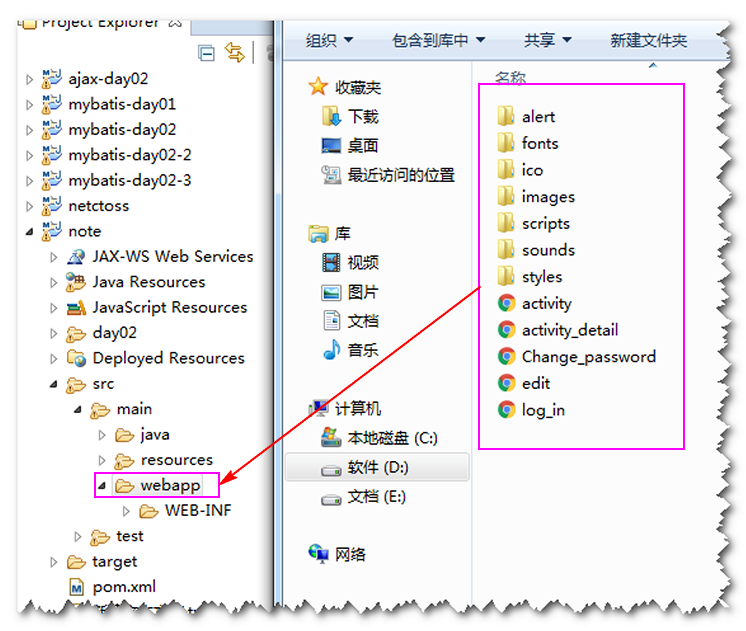
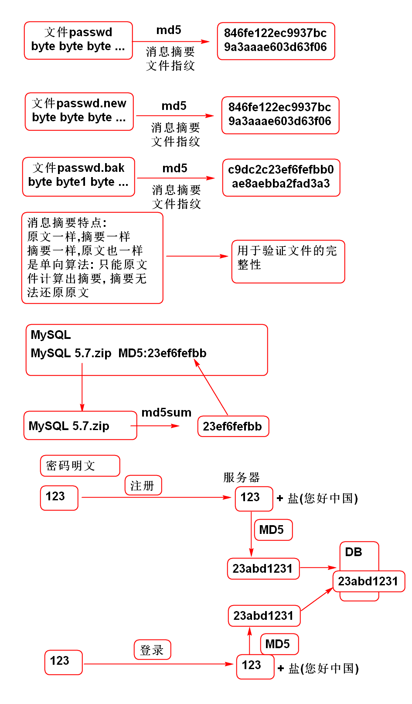
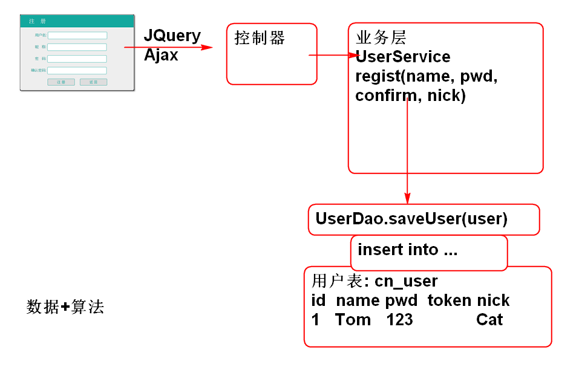

# 云笔记

## 登录功能

### 导入用户界面

将静态界面导入到项目中:

部署测试: http://localhost:8080/note/log_in.html

### 更新log_in.html 

1. 更新log_in.html, 添加JS代码:

		...
		<head>
			<meta charset="UTF-8"> 
			<link rel="stylesheet" href="styles/login.css"/>
		
			
			
		</head>
		...

2. 更新log_in.html 增加显示错误信息的位置

		...
		<dt>
			

				用户名:&nbsp;<input type="text" name="" id="count" tabindex='1'/>
				
			

		</dt>
		<dt>
			

				密&nbsp;&nbsp;&nbsp;码:&nbsp;<input type="password" name="" id="password" tabindex='2'/>
				
			

		</dt>
		...

3. 添加scripts/login.js文件

		var SUCCESS = 0;
		
		$(function(){
			
			//console.log("Hello!!");
			
			//1. 绑定 登录 按钮
			//2. 在按键被点击时候获取 用户名和密码
			//3. 检查用户名和密码 是否符合规则 ??
			//4. 如何符合规则就向服务器发送
			//5. 处理服务器返回的结果(成功/失败)
			
			$('#login').click(loginAction); 
			$('#count').blur(checkName);
			$('#password').blur(checkPassword);
		});
		
		function checkName(){
			var name = $('#count').val();
			var reg = /^\w{3,10}$/;
			$('#count-msg').empty();
			if(! reg.test(name)){
				$('#count-msg').append("3~10个字符");
				return false;
			}
			return true;
		}
		function checkPassword(){
			var pwd = $('#password').val();
			var reg = /^\w{3,10}$/;
			$('#password-msg').empty();
			if(! reg.test(pwd)){
				$('#password-msg').append("3~10个字符");
				return false;
			}
			return true;
		}
		
		function loginAction(){
			//console.log("Login Action!");
			var name = $('#count').val();
			var password = $('#password').val();
			//检查用户名和密码的规则
			var n = checkName() + checkPassword();
			if(n!=2){
				return;
			}
			//向服务器发送用户名和密码
			var url="user/login.do";
			//data中的key与服务端控制器参数名一致
			//data中的值来源于页面表单中的数据
			var data={'name':name,'password':password};
			$.post(url, data, function(result){
				//服务器返回result 是JsonResult序列化的
				//结果. result: {state:0,data:...,message:...}
				//console.log(result);
				if(result.state==SUCCESS){
					//登录成功
					//跳转到 edit.html
					console.log('成功');
					location.href='edit.html';
				}else{
					//显示错误消息
					var msg=result.message;
					console.log(msg);
					$('#count-msg').html(msg);
				}
			});
		}

4. 测试登录功能

## 密码安全问题

利用MD5进行加密是常见的方法.

MD5 工作原理:

利用 Commons-codec 实现MD5:

1. 导入相关的包:

		<dependency>
		  <groupId>commons-codec</groupId>
		  <artifactId>commons-codec</artifactId>
		  <version>1.10</version>
		</dependency>	

2. 测试MD5算法:
 
		public class UtilTestCase {
		
			@Test
			public void testMD5(){
				String str = "123";
				String salt = "您好中国";
				//计算123的摘要
				String md5=DigestUtils.md5Hex(str);
				//计算123加盐的摘要
				String md=DigestUtils.md5Hex(str+salt);
				System.out.println(md5);
				System.out.println(md);
			}
		}

## 注册

分析: 数据结构+算法

### 实现数据持久层

1. 添加持久层接口方法 UserDao.java

		/**
		 * 将用户信息保存到数据库中
		 * @param user 被保存的用户信息
		 * @return 更新数据行数, 返回1表示更新成功
		 */
		int saveUser(User user);	

2. 添加SQL语句 UserMapper.xml:

		<insert id="saveUser"
			parameterType="cn.tedu.note.entity.User">
			insert into cn_user (
				cn_user_id, 
				cn_user_name,
				cn_user_password,
				cn_user_token,
				cn_user_nick
			) values	(
				#{id},
				#{name},
				#{password},
				#{token},
				#{nick}
			)
		</insert>	

3. 测试 UserDaoTestCase.java:
	
		public class UserDaoTestCase 
			extends BaseTestCase{
			UserDao dao;
			
			@Before
			public void initDao(){
				dao=ctx.getBean(
						"userDao", UserDao.class);
			}
			
			@Test
			public void testSaveUser(){
				User user = new User("007",
						"Tom", "123", "", "Cat");
				int i = dao.saveUser(user);
				System.out.println(i); 
			}
		}
	
### 实现业务层

1. 添加业务层方法 UserService.java:

		User regist(String name, String nick,
			String password, String confirm )
			throws UserExistException, 
			NameException, PasswordException;
		
2. 实现业务层

		public User regist(String name,String nick,
				String password, String confirm)
				throws UserExistException, NameException, PasswordException {
			String reg = "^\\w{3,10}$";
			if(name==null||name.trim().isEmpty()){
				throw new NameException("不能空");
			}
			if(! name.matches(reg)){
				throw new NameException("3~10字符");
			}
			if(password==null||password.trim().isEmpty()){
				throw new PasswordException("不能空");
			}
			if(! password.matches(reg)){
				throw new PasswordException("3-10字符");
			}
			if(! password.equals(confirm)){
				throw new PasswordException("确认密码不一致");
			}
			//检查用户是否已经注册!
			User user = userDao.findUserByName(name);
			if(user!=null){
				throw new UserExistException("已经注册");
			}
			if(nick==null || nick.trim().isEmpty()){
				nick = name;
			}
			//检查了所有参数, 保存数据
			String id = UUID.randomUUID().toString();
			String token = "";
			String md5 = 
				DigestUtils.md5Hex(password+"世界你好");
			user = new User(id,name,md5,token,nick);
			int i = userDao.saveUser(user);
			if(i!=1){
				throw new RuntimeException("保存失败");
			}
			return user;
		}

> 异常类UserExistException的实现, 省略了

3. 测试:

	public class UserSeviceTestCase 
		extends BaseTestCase{
		UserService service;
		@Before
		public void initService(){
			service=ctx.getBean(
					"userService", UserService.class);
		}
		
		@Test
		public void testRegist(){
			User user = service.regist
				("Jerry", "Mouse", "123", "123");
			System.out.println(user); 
		}
	}
		

### 实现控制器

为了便于重构,为了方便处理异常,重构了控制器,抽取了控制器基础类:

1. 抽取了控制器基础类

		public abstract class BaseController {
		 
			@ExceptionHandler(Exception.class)
			@ResponseBody
			public JsonResult<Object> expHandler(Exception e) {
				e.printStackTrace();
				return new JsonResult<Object>(e);
			}
		
		}

2. 实现控制器方法 UserController

		@Controller
		@RequestMapping("/user")
		public class UserController extends BaseController {
			
			@Resource
			private UserService userService;
			
			@RequestMapping("/login.do")
			@ResponseBody
			//返回值: {state:0,data:{id...}}
			//返回值: {state:1,message:"用户名..."}
			public JsonResult<User> login(String name, 
					String password){
				User user=
					userService.login(name, password);
				return new JsonResult<User>(user); 
			}
			/**
			 * 注册控制器
			 */
			@RequestMapping("/regist.do")
			@ResponseBody
			public JsonResult<User> regist(
					String name, 
					String password, 
					String confirm, 
					String nick){
				User user=userService.regist(
					name, nick, password, confirm);
				return new JsonResult<User>(user);
			}
		}

3. 用浏览器测试

### 编写登录界面脚本

1. 重构log_in.html, 删除部分脚本:

		window.onload=function(){
			var t =setTimeout("get('zc').style.visibility='visible'",800);
			/*
			get('final_password').onblur=function(){
				var npassword=get('regist_password').value;
				var fpassword=get('final_password').value;
				if(npassword!=fpassword){
					get('warning_3').style.display='block';
				}
			}
			get('regist_password').onblur=function(){
				var npassword=get('regist_password').value.length;
				if(npassword<6&&npassword>0){
					get('warning_2').style.display='block';
				}
			}
			get('regist_password').onfocus=function(){
				get('warning_2').style.display='none';
			}
			get('final_password').onfocus=function(){
				get('warning_3').style.display='none';
			}
			*/
		}

2. 绑定事件 login.js:

		//绑定注册界面的事件
		$('#regist_username').blur(checkRegistName);
		$('#regist_password').blur(checkRegistPassword);
		$('#final_password').blur(checkConfirmPassword);
		$('#regist_button').click(registAction);

3. 编写事件处理脚本 login.js:
	
		function checkName(){
			var name = $('#count').val();
			var reg = /^\w{3,10}$/;
			$('#count-msg').empty();
			if(! reg.test(name)){
				$('#count-msg').append("3~10个字符");
				return false;
			}
			return true;
		}
		function checkPassword(){
			var pwd = $('#password').val();
			var reg = /^\w{3,10}$/;
			$('#password-msg').empty();
			if(! reg.test(pwd)){
				$('#password-msg').append("3~10个字符");
				return false;
			}
			return true;
		}
		
		function loginAction(){
			//console.log("Login Action!");
			var name = $('#count').val();
			var password = $('#password').val();
			//检查用户名和密码的规则
			var n = checkName() + checkPassword();
			if(n!=2){
				return;
			}
			//向服务器发送用户名和密码
			var url="user/login.do";
			//data中的key与服务端控制器参数名一致
			//data中的值来源于页面表单中的数据
			var data={'name':name,'password':password};
			$.post(url, data, function(result){
				//服务器返回result 是JsonResult序列化的
				//结果. result: {state:0,data:...,message:...}
				//console.log(result);
				if(result.state==SUCCESS){
					//登录成功
					//跳转到 edit.html
					console.log('成功');
					location.href='edit.html';
				}else{
					//显示错误消息
					var msg=result.message;
					console.log(msg);
					$('#count-msg').html(msg);
				}
			});
		}
		
		
		function  checkRegistName(){
			console.log("checkRegistName");
			var name=$('#regist_username').val();
			var reg=/^\w{3,10}$/;
			$('#warning_1 span').empty();
			$('#warning_1').hide();
			if(reg.test(name)){
				return true;
			}
			$('#warning_1 span').html('3~10字符');
			$('#warning_1').show();
			return false;
		}
		
		function  checkRegistPassword(){
			console.log("checkRegistPassword");
			var pwd=$('#regist_password').val();
			var reg=/^\w{3,10}$/;
			$('#warning_2 span').empty();
			$('#warning_2').hide();
			if(reg.test(pwd)){
				return true;
			}
			$('#warning_2 span').html('3~10字符');
			$('#warning_2').show();
			return false;
		}
		
		function  checkConfirmPassword(){
			console.log("checkConfirmPassword");
			var pwd=$('#regist_password').val();
			var pwd2=$('#final_password').val();
			
			$('#warning_3 span').empty();
			$('#warning_3').hide();
			if(pwd != "" && pwd==pwd2){
				return true;
			}
			$('#warning_3 span').html('密码不一致');
			$('#warning_3').show();
			return false;
		
		}
		
		function registAction(){
			var n = checkRegistName()+
					checkRegistPassword()+
					checkConfirmPassword();
			if(n!=3){
				return;
			}
			var name=$('#regist_username').val();
			var pwd=$('#regist_password').val();
			var pwd2=$('#final_password').val();
			var nick=$('#nickname').val();
			
			var url='user/regist.do';
			var data = {name:name,password:pwd,
					confirm:pwd2,nick:nick};
			console.log(data);
			
			$.post(url, data, function(result){
				console.log(result);
				if(result.state==SUCCESS){
					var n = result.data.name;
					$('#count').val(n);
					$('#count').focus();
					$('#back').click();
				}else{
					var msg=result.message;
					$('#warning_1 span').html(msg);
					$('#warning_1').show();
				}
			});
		}

## 加密登录验证

	public User login(String name, 
			String password) 
			throws NameException, 
			PasswordException {
		//根据用户输入的用户名和密码检查是否登录
		if(name==null || name.trim().isEmpty()){
			throw new NameException("用户名不能空");
		}
		if(password==null || password.trim().isEmpty()){
			throw new PasswordException("密码不能空");
		}
		//获取用户信息, 比较密码
		User user=userDao.findUserByName(name);
		if(user==null){
			throw new NameException("用户不存在");
		}
		String md5 = DigestUtils.md5Hex(
				password+"世界你好");
		if(md5.equals(user.getPassword())){
			return user;//登录成功
		}
		throw new PasswordException("密码错!");
	}

----------------

## 作业

1. 实现登录功能
2. 实现注册功能

