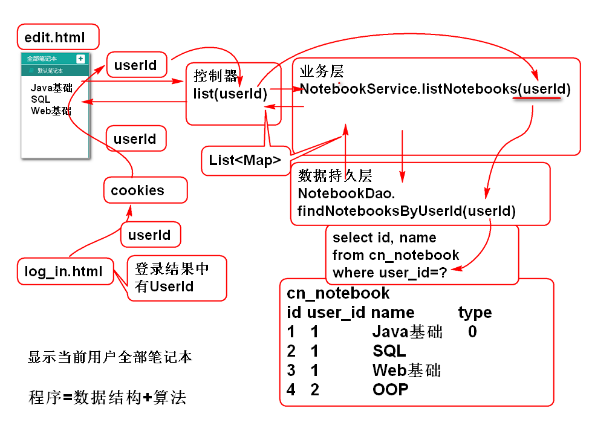
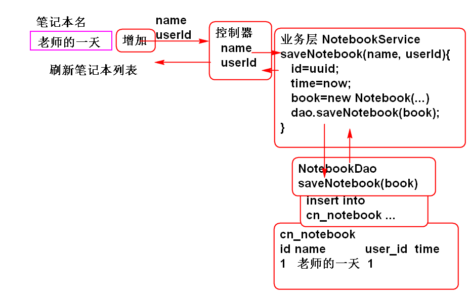

# 云笔记

## 获取笔记本列表功能

业务分析

### 实现持久层

1. 添加持久层接口NotebookDao.java:

		public interface NotebookDao {
			
			List<Map<String, Object>> 
				findNotebooksByUserId(String userId);
		}

2. 添加MyBatis映射文件 mappers/NotebookMapper.xml

		<mapper namespace="cn.tedu.note.dao.NotebookDao">
			<select id="findNotebooksByUserId"
				parameterType="string"
				resultType="map">
				select
					cn_notebook_id as "id",
					cn_notebook_name as "name"
				from 
					cn_notebook
				where	
					cn_user_id=#{userId}
			</select>
		</mapper>
		
3. 测试:

		public class NotebookDaoTestCase
			extends BaseTestCase{
			
			NotebookDao dao;
			
			@Before 
			public void initDao(){
				dao = ctx.getBean(
					"notebookDao", NotebookDao.class);
			}
			@Test
			public void testFindNotebooksByUserId(){
				String userId="ea09d9b1-ede7-4bd8-b43d-a546680df00b";
				List<Map<String, Object>> list=
					dao.findNotebooksByUserId(userId);
				for (Map<String, Object> map : list) {
					System.out.println(map);
				}
			}
		}

### 添加业务层

1. 添加业务层接口

		public interface NotebookService {
			List<Map<String, Object>> listNotebooks(
					String userId) 
					throws UserNotFoundException; 
		}

2. 实现业务接口

		@Service("notebookService")
		public class NotebookServiceImpl
			implements NotebookService{
		
			@Resource
			private NotebookDao notebookDao;
			
			@Resource 
			private UserDao userDao;
			
			public List<Map<String, Object>> listNotebooks(
					String userId) 
					throws UserNotFoundException {
				if(userId==null || userId.trim().isEmpty()){
					throw new UserNotFoundException("User Id 空");
				}
				//
				User user=userDao.findUserById(userId);
				if(user==null){
					throw new UserNotFoundException("ID错误");
				}
				return notebookDao.findNotebooksByUserId(userId);
				//
			}
		}

	>根据实际业务逻辑,设计业务算法过程.

3. 添加持久层接口方法 UserDao.java:

		User findUserById(String userId);

4. 添加SQL 语句 UserMapper.xml:
	
		<select id="findUserById"	
			parameterType="string"
			resultType="cn.tedu.note.entity.User">
			select 
				cn_user_id as id,
				cn_user_name as name,
				cn_user_password as password,
				cn_user_token as token,
				cn_user_nick as nick
			from
				cn_user
			where
				cn_user_id = #{userId}
		</select>	

5. 测试:

		public class NotebookServiceTestCase 
			extends BaseTestCase {
			
			NotebookService service;
			
			@Before
			public void initService(){
				this.service = ctx.getBean(
					"notebookService",NotebookService.class);
			}
			@Test
			public void testListNotebooks(){
				String userId="ea09d9b1-ede7-4bd8-b43d-a546680df00b";
				List<Map<String, Object>> list=
					service.listNotebooks(userId);
				for (Map<String, Object> map : list) {
					System.out.println(map); 
				}
			}
		}

### 控制器

1. 添加控制器类:
	
		@Controller
		@RequestMapping("/notebook")
		public class NotebookController 
			extends BaseController{
		
			@Resource
			private NotebookService notebookService;
			
			@RequestMapping("/list.do")
			@ResponseBody
			public JsonResult<List<Map<String, Object>>>
				list(String userId){
				List<Map<String, Object>> list=
					notebookService.listNotebooks(userId);
				return new JsonResult<List<Map<String,Object>>>(list);
			}
		}

2. 测试:

		http://localhost:8080/note/notebook/list.do?userId=ea09d9b1-ede7-4bd8-b43d-a546680df00b
		http://localhost:8080/note/notebook/list.do?userId=123
		http://localhost:8080/note/notebook/list.do

> 提示: 不仅仅要测试正常情况, 也要测试异常情况

### 界面JS脚本

1. 更新login.js, 登录成功是保存用户ID到Cookie中.

		function loginAction(){
			//console.log("Login Action!");
			var name = $('#count').val();
			var password = $('#password').val();
			//检查用户名和密码的规则
			var n = checkName() + checkPassword();
			if(n!=2){
				return;
			}
			//向服务器发送用户名和密码
			var url="user/login.do";
			//data中的key与服务端控制器参数名一致
			//data中的值来源于页面表单中的数据
			var data={'name':name,'password':password};
			$.post(url, data, function(result){
				//服务器返回result 是JsonResult序列化的
				//结果. result: {state:0,data:...,message:...}
				//console.log(result);
				if(result.state==SUCCESS){
					//登录成功
					//跳转到 edit.html
					console.log('成功');
					
					//登录成功以后将ID保存到Cookies中
					var userId=result.data.id;
					setCookie("userId", userId);
					
					location.href='edit.html';
				}else{
					//显示错误消息
					var msg=result.message;
					console.log(msg);
					$('#count-msg').html(msg);
				}
			});
		} 

		> 利用浏览器测试是否有Cookie 被保存了.

2. 更新edit.html, 添加js脚本:

		
		
		
			
		

3. 添加	edit_init.js

		/* scripts/edit_init.js */
		
		var SUCCESS = 0;
		
		$(function(){
			//初始化 edit.html 页面
			//var userId=getCookie('userId');
			//console.log(userId);
			
			//在网页加载以后立即加载笔记本列表信息
			loadNotebooksAction();
		});

4.  添加 notebook.js

		/* scripts/notebook.js */
		
		/**
		 * 用于加载笔记本列表信息
		 * 
		 * 在页面加载以后立即执行
		 */
		function loadNotebooksAction(){
			console.log('loadNotebooksAction');
			//发起Ajax请求, 获取笔记本列表数据
			var url='notebook/list.do';
			var data={userId:getCookie('userId')};
			console.log(data);
			$.getJSON(url, data, function(result){
				console.log(result);
				if(result.state==SUCCESS){
					var list=result.data;
					console.log(list);
					//将笔记本列表显示到页面上
					showNotebooks(list);
				}else{
					var msg=result.message;
					alert(msg);
				}
			});
		}
		//笔记本列表区域的显示模板
		//替换[name]为真正笔记本名
		var notebookTemplate=
			'<li class="online">' +
				'<a >' + // class="checked"
					'<i class="fa fa-book" title="online" rel="tooltip-bottom"></i>'+
					'[name]'+
				'</a>'+
			'</li>';

		function showNotebooks(notebooks){
			//1. 清空 ul 
			//2. 遍历 notebooks 
			//3. 为每个notebook创建一个li
			//     将模板[name]替换为笔记本名即得到 li 
			//4. 将li添加到ul
			$('#notebooks').empty();
			for(var i=0; i<notebooks.length; i++){
				var notebook=notebooks[i];
				var li = notebookTemplate.replace(
						'[name]', notebook.name);
				console.log(li);
				$('#notebooks').append(li);
			}
		}

5. 准备测试数据

		查询那个用户笔记本多:
		select 
			n.cn_user_id, u.cn_user_name 
		from 
			cn_notebook n
		left join 
			cn_user u 
		on 
			n.cn_user_id = u.cn_user_id;
		
		//查询已经加密的密码
		select u.cn_user_password from cn_user u where u.cn_user_name='bai';
	
		//更新测试用户的密码
		update 
			cn_user 
		set 
			cn_user_password='6ae7acc060ca9e9bdc53f968fd3ff3a4'
		where 
			cn_user_name='zhoujia';
		
6. 测试...

> 注意: 测试时候要情况浏览器的缓存, 否则可能修改结果不会被显示

## 添加笔记功能

添加笔记的原理

### 持久层实现

1. 添加实体类 Notebook.java

		public class Notebook implements Serializable {
			
			private static final long serialVersionUID = 6645889448531380183L;
		
			private String id;
			private String userId;
			private String typeId;
			private String name;
			private String desc;
			private Timestamp createTime;
			
			public Notebook() {
			}
		
			public Notebook(String id, String userId, String typeId, String name, String desc, Timestamp createTime) {
				super();
				this.id = id;
				this.userId = userId;
				this.typeId = typeId;
				this.name = name;
				this.desc = desc;
				this.createTime = createTime;
			}
		
			public String getId() {
				return id;
			}
		
			public void setId(String id) {
				this.id = id;
			}
		
			public String getUserId() {
				return userId;
			}
		
			public void setUserId(String userId) {
				this.userId = userId;
			}
		
			public String getTypeId() {
				return typeId;
			}
		
			public void setTypeId(String typeId) {
				this.typeId = typeId;
			}
		
			public String getName() {
				return name;
			}
		
			public void setName(String name) {
				this.name = name;
			}
		
			public String getDesc() {
				return desc;
			}
		
			public void setDesc(String desc) {
				this.desc = desc;
			}
		
			public Timestamp getCreateTime() {
				return createTime;
			}
		
			public void setCreateTime(Timestamp createTime) {
				this.createTime = createTime;
			}
		
			@Override
			public String toString() {
				return "Notebook [id=" + id + ", userId=" + userId + ", typeId=" + typeId + ", name=" + name + ", desc=" + desc
						+ ", createTime=" + createTime + "]";
			}
		
			@Override
			public int hashCode() {
				final int prime = 31;
				int result = 1;
				result = prime * result + ((id == null) ? 0 : id.hashCode());
				return result;
			}
		
			@Override
			public boolean equals(Object obj) {
				if (this == obj)
					return true;
				if (obj == null)
					return false;
				if (getClass() != obj.getClass())
					return false;
				Notebook other = (Notebook) obj;
				if (id == null) {
					if (other.id != null)
						return false;
				} else if (!id.equals(other.id))
					return false;
				return true;
			}
		}

2. 添加持久层方法 NotebookDao:
	
		int saveNotebook(Notebook book);

3. 添加SQL, NotebookMapper.xml:

		<insert id="saveNotebook"
			parameterType="cn.tedu.note.entity.Notebook">
			insert into	cn_notebook(
				cn_notebook_id, 
				cn_user_id,
				cn_notebook_type_id,
				cn_notebook_name,
				cn_notebook_desc,
				cn_notebook_createtime
			) values (
				#{id},
				#{userId},
				#{typeId},
				#{name},
				#{desc},
				#{createTime}
			)
		</insert>

4. 测试 NotebookDaoTestCase.java:

		@Test
		public void testSaveNotebook(){
			String id=UUID.randomUUID().toString();
			String userId="ea09d9b1-ede7-4bd8-b43d-a546680df00b";
			String typeId="0";
			String name = "Java";
			String desc="Java基础";
			Timestamp createTime= 
				new Timestamp(System.currentTimeMillis()); 
			Notebook notebook=new Notebook(id, userId, typeId, name, desc, createTime); 
			dao.saveNotebook(notebook);
		}

### 业务层

1. 添加业务层方法 NotebookService.java:

		Notebook saveNotebook(String name, String userId)
			throws UserNotFoundException; 	

2. 实现业务层方法 NotebookServiceImpl.java:

		public Notebook saveNotebook(
				String name, String userId) 
				throws UserNotFoundException {
			if(name==null||name.trim().isEmpty()){
				throw new NameException("笔记本名不能空！");
			}
			if(userId==null||userId.trim().isEmpty()){
				throw new UserNotFoundException("userId不能空！");
			}
			User user=userDao.findUserById(userId);
			if(user==null){
				throw new UserNotFoundException("ID错误");
			}
			String id=UUID.randomUUID().toString();
			String typeId="1";
			String desc="";
			Timestamp createTime=new Timestamp(System.currentTimeMillis());
			Notebook book = new Notebook(id, userId, typeId, name, desc, createTime);
			
			int n = notebookDao.saveNotebook(book);
			if(n==1){
				return book;
			}
			throw new RuntimeException("保存失败");
		}

3. 测试 NotebookServiceTestCase.java:
	
		@Test
		public void testSaveNotebook(){
			String name="测试笔记本";
			String userId="ea09d9b1-ede7-4bd8-b43d-a546680df00b";
			Notebook book = service.saveNotebook(name, userId);
			System.out.println(book);
		}

### 控制器

1. 添加控制器方法 NotebookController.java:
	
		@RequestMapping("/save.do")
		@ResponseBody
		public JsonResult<Notebook> save(
				String name, String userId){
			Notebook book=notebookService.saveNotebook(name, userId);
			return new JsonResult<Notebook>(book);
		}

3. 部署测试:

		http://localhost:8080/note/notebook/save.do?name=Test&userId=39295a3d-cc9b-42b4-b206-a2e7fab7e77c

-------------------------

## 作业

1. 实现笔记本列表功能
2. 实现笔记本添加服务端

