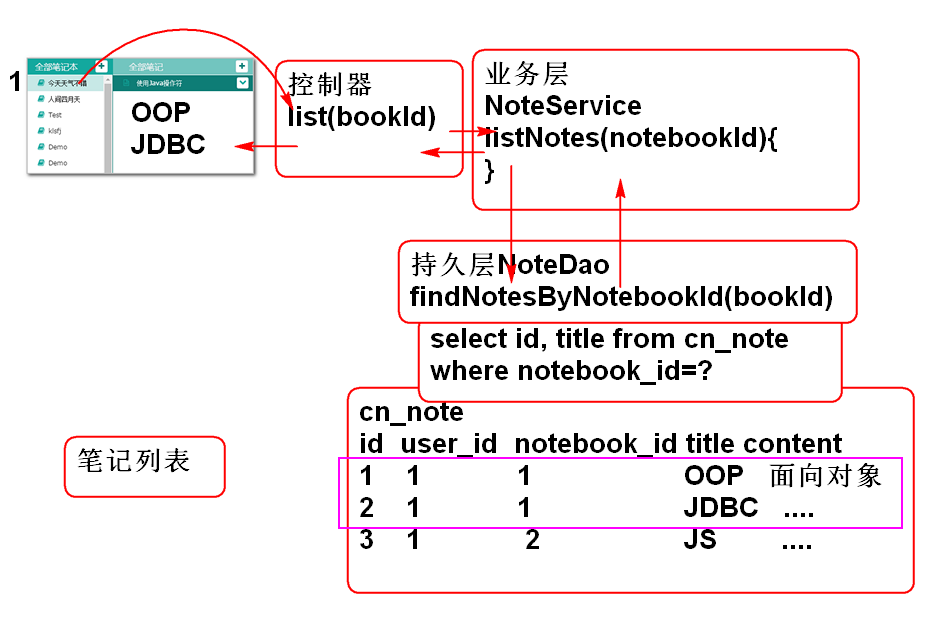
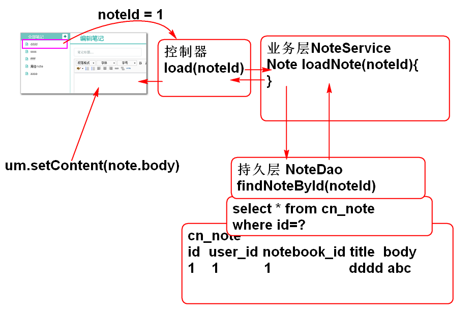

# 云笔记

## 编写笔记本前端脚本

在edit.html页面中预留了对话框加载区域和对话框背景:

	<!-- alert_background-->
	

	<!-- alert_notebook -->
	

可以利用如下脚本异步加载对话框:

	var url="alert/alert_notebook.html";
	$('#can').load(url);
	$('.opacity_bg').show();

清除对话框:

	$('#can').empty();
	$('.opacity_bg').hide();

### 添加笔记本客户端代码

1. 在 edit_init.js 中绑定打开添加笔记本对话框事件:

		//点击#add_notebook时候打开添加笔记本对话框
		$('#add_notebook').click(openAddNotebookDialog);

2. 在 notebook.js 中添加打开对话框的方法

		function openAddNotebookDialog(){
			var url="alert/alert_notebook.jsp";
			$('#can').load(url);
			$('.opacity_bg').show();
		}

3. 在 edit_init.js 中绑定关闭对话框事件:

		//利用事件冒泡,在can上绑定关闭按钮
		$('#can').on('click',
			'.close,.cancel',closeDialog);

4. 在 edit_init.js 中添加关闭窗口函数:

		function closeDialog(){
			$('#can').empty();
			$('.opacity_bg').hide();
		}

5. 更新 alert/alert_notebook.html, 为jsp文件, 添加.add-notebook

		<%@ page contentType="text/html; charset=UTF-8" %>
		

			

				

					

						<button type="button" class="close" data-dismiss="modal" aria-hidden="true">×</button>
						<h4 class="modal-title" id="modalBasicLabel">新建笔记本</h4>
					

					

						

                            <label class="col-sm-3 control-label" for="input" style='margin-top:5px;'>笔记本名称</label>
                            

                                <input type="text" class="form-control" id="input_notebook">
                            

                        

					

					

						<button type="button" class="btn btn-default cancel" data-dismiss="modal">取 消</button>
						<button type="button" class="btn btn-primary sure add-notebook">创 建</button>
					

				

			

		

	> 提示: 将html改为jsp是为了添加contentType解决乱码问题
	

6. 在 edit_init.js 中绑定 添加笔记本 事件:

		//绑定笔记本对话框中的添加笔记本按钮事件
		$('#can').on('click', 
			'.add-notebook', addNotebookAction);

7. 在 notebook.js 中添加 添加笔记本 函数:

		function addNotebookAction(){
			var name=$('#input_notebook').val();
			if(! name || name.replace(' ','')==''){
				return;
			}
			
			var url='notebook/save.do';
			var data = {userId:getCookie('userId'),
						name:name};
			console.log(data);
			
			$.post(url, data, function(result){
				console.log(result);
				//将新的笔记本信息插入到笔记本列表中第一个
				//关闭添加对话框
				if(result.state==SUCCESS){
					var notebook = result.data;
					var li = notebookTemplate.replace(
							'[name]', notebook.name);
					$('#notebooks').prepend(li);
					closeDialog();
				}else{
					alert(result.message);
				}
			});
		}

8. 测试...

## 笔记列表功能

原理

### 数据持久层

1. 添加数据层接口
	
		public interface NoteDao {
			List<Map<String, Object>> 
				findNotesByNotebookId(String notebookId);
		}

2. 添加SQL, NoteMapper.xml:

		<mapper namespace="cn.tedu.note.dao.NoteDao">
			<select id="findNotesByNotebookId"
				parameterType="string" 
				resultType="map">
				select 
					cn_note_id as id,
					cn_note_title as title
				from
					cn_note
				where
					cn_notebook_id=#{notebookId}
				order by
					cn_note_last_modify_time desc
			</select>
		</mapper>

3. 测试 NoteDaoTestCase:

		public class NoteDaoTestCase extends BaseTestCase {
			
			NoteDao dao;
			
			@Before
			public void initDao(){
				dao=ctx.getBean("noteDao", NoteDao.class);
			}
			
			@Test
			public void testFindNotesByNotebookId(){
				String notebookId="d0b0727f-a233-4a1f-8600-f49fc1f25bc9";
				List<Map<String, Object>> list=
					dao.findNotesByNotebookId(notebookId);
				for (Map<String, Object> map : list) {
					System.out.println(map);
				}
			}
		}	

### 业务层

1. 添加业务层接口

		public interface NoteService {
			
			List<Map<String, Object>> listNotes(
				String notebookId)
				throws NotebookNotFoundException;
		}
	
	> 异常类NotebookNotFoundException 略

2. 实现业务层接口

		@Service("noteService")
		public class NoteServiceImpl implements NoteService {
		
			@Resource
			private NoteDao noteDao;
			
			@Resource 
			private NotebookDao notebookDao;
			
			public List<Map<String, Object>> listNotes(
					String notebookId) throws NotebookNotFoundException {
				if(notebookId==null||notebookId.trim().isEmpty()){
					throw new NotebookNoteFoundException("notebookId不能空");
				}
				Notebook book = notebookDao.findNotebookById(notebookId);
				if(book == null){
					throw new NotebookNoteFoundException("notebookId不存在");
				}
				
				return noteDao.findNotesByNotebookId(notebookId);
			}
		
		}

3. 添加笔记本查询方法 NotebookDao

		Notebook findNotebookById(String notebookId);

4. 实现笔记本查询SQL  NotebookMapper.xml

		<select id="findNotebookById"
			parameterType="string"
			resultType="cn.tedu.note.entity.Notebook">
			select
				cn_notebook_id as id,
				cn_user_id as userId,
				cn_notebook_type_id as typeId,
				cn_notebook_name as name,
				cn_notebook_desc as "desc",
				cn_notebook_createtime as createTime
			from 
				cn_notebook
			where	
				cn_notebook_id=#{notebookId}
		</select>

5. 测试

		public class NoteServiceTestCase 
			extends BaseTestCase {
			
			NoteService service;
			
			@Before
			public void initService(){
				this.service = ctx.getBean(
					"noteService",NoteService.class);
			}
			@Test
			public void testListNotes(){
				String notebookId="d0b0727f-a233-4a1f-8600-f49fc1f25bc9";
				List<Map<String, Object>> list=
					service.listNotes(notebookId);
				for (Map<String, Object> map : list) {
					System.out.println(map);
				}
		
			}
			
		}

### 控制器

1. 填加控制器类:

		@Controller
		@RequestMapping("/note")
		public class NoteController 
			extends BaseController{
		
			@Resource
			private NoteService noteService;
			
			@RequestMapping("/list.do")
			@ResponseBody
			public JsonResult<List<Map<String, Object>>>
				list(String notebookId){
				List<Map<String, Object>> list=
					noteService.listNotes(notebookId);
				return new JsonResult<List<Map<String,Object>>>(list);
			}
			
		}	

2. 测试:

	http://localhost:8080/note/note/list.do?notebookId=d0b0727f-a233-4a1f-8600-f49fc1f25bc9

### 界面整合

0. 重构 notebooks.js, 显示笔记本时候在li元素上绑定 笔记本的 ID:

		function showNotebooks(notebooks){
			//1. 清空 ul 
			//2. 遍历 notebooks 
			//3. 为每个notebook创建一个li
			//     将模板[name]替换为笔记本名即得到 li 
			//4. 将li添加到ul
			$('#notebooks').empty();
			for(var i=0; i<notebooks.length; i++){
				var notebook=notebooks[i];
				var li = notebookTemplate.replace(
						'[name]', notebook.name);
				console.log(li);
				
				//绑定每个笔记本的ID到li元素上
				li = $(li).data(
						'notebookId', notebook.id);
				
				$('#notebooks').append(li);
			}
		}

1. edit.html 中引入脚本文件

		

2. 添加点击事件绑定 edit_init.js

		//绑定笔记本列表点击事件
		$('#notebooks').on('click','li',showNotesAction);

3. 添加文件 scripts/note.js, 文件中添加事件处理方法:

		/* note.js 用于存储于笔记操作有关的js脚本 */
		
		function showNotesAction(){
			var li = $(this);

			//设置视觉效果
			li.parent().find('a').removeClass('checked');
			li.children('a').addClass('checked');

			var id=li.data('notebookId');
			var url='note/list.do';
			var data={notebookId:id};
			$.getJSON(url, data, function(result){
				console.log(result);
				if(result.state==SUCCESS){
					var list = result.data;
					//显示全部的笔记
					showNotes(list);
				}else{
					alert(result.message);
				}
			});
		} 

4. note.js 中添加方法, 显示全部的笔记

		var noteTemplate='<li class="online">'+
			'<a>'+
			'<i class="fa fa-file-text-o" title="online" rel="tooltip-bottom"></i>'+
			'[title]<button type="button" class="btn btn-default btn-xs btn_position btn_slide_down"><i class="fa fa-chevron-down"></i></button>'+
			'</a>'+
			'
'+
			'<dl>'+
			'	<dt><button type="button" class="btn btn-default btn-xs btn_move" title="移动至..."><i class="fa fa-random"></i></button></dt>'+
			'	<dt><button type="button" class="btn btn-default btn-xs btn_share" title="分享"><i class="fa fa-sitemap"></i></button></dt>'+
			'	<dt><button type="button" class="btn btn-default btn-xs btn_delete" title="删除"><i class="fa fa-times"></i></button></dt>'+
			'</dl>'+
			'
'+
			'</li>';
		
		function showNotes(notes){
			//找到UL元素
		 	var ul = $('#pc_part_2 ul');
		 	ul.empty();
		 	console.log(ul);
		 	for(var i=0; i<notes.length; i++){
		 		var note=notes[i];
		 		li = noteTemplate.replace(
		 			'[title]', note.title);
		 		console.log(li);
		 		ul.append(li);
		 	}
		}

## 显示笔记功能

原理:

### 数据层

1. 添加实体类Note.java

		public class Note implements Serializable{
			private static final long serialVersionUID = -6699267497847540276L;
		
			private String id;
			private String notebookId;
			private String userId;
			private String statusId;
			private String typeId;
			private String title;
			private String body;
			private long createTime;
			private long lastModifyTime;
			
			public Note() {
			}
		
			public Note(String id, String notebookId, String userId, String statusId, String typeId, String title, String body,
					long createTime, long lastModifyTime) {
				super();
				this.id = id;
				this.notebookId = notebookId;
				this.userId = userId;
				this.statusId = statusId;
				this.typeId = typeId;
				this.title = title;
				this.body = body;
				this.createTime = createTime;
				this.lastModifyTime = lastModifyTime;
			}
		
			public String getId() {
				return id;
			}
		
			public void setId(String id) {
				this.id = id;
			}
		
			public String getNotebookId() {
				return notebookId;
			}
		
			public void setNotebookId(String notebookId) {
				this.notebookId = notebookId;
			}
		
			public String getUserId() {
				return userId;
			}
		
			public void setUserId(String userId) {
				this.userId = userId;
			}
		
			public String getStatusId() {
				return statusId;
			}
		
			public void setStatusId(String statusId) {
				this.statusId = statusId;
			}
		
			public String getTypeId() {
				return typeId;
			}
		
			public void setTypeId(String typeId) {
				this.typeId = typeId;
			}
		
			public String getTitle() {
				return title;
			}
		
			public void setTitle(String title) {
				this.title = title;
			}
		
			public String getBody() {
				return body;
			}
		
			public void setBody(String body) {
				this.body = body;
			}
		
			public long getCreateTime() {
				return createTime;
			}
		
			public void setCreateTime(long createTime) {
				this.createTime = createTime;
			}
		
			public long getLastModifyTime() {
				return lastModifyTime;
			}
		
			public void setLastModifyTime(long lastModifyTime) {
				this.lastModifyTime = lastModifyTime;
			}
		
			@Override
			public String toString() {
				return "Note [id=" + id + ", notebookId=" + notebookId + ", userId=" + userId + ", statusId=" + statusId
						+ ", typeId=" + typeId + ", title=" + title + ", body=" + body + ", createTime=" + createTime
						+ ", lastModifyTime=" + lastModifyTime + "]";
			}
		
			@Override
			public int hashCode() {
				final int prime = 31;
				int result = 1;
				result = prime * result + ((id == null) ? 0 : id.hashCode());
				return result;
			}
		
			@Override
			public boolean equals(Object obj) {
				if (this == obj)
					return true;
				if (obj == null)
					return false;
				if (getClass() != obj.getClass())
					return false;
				Note other = (Note) obj;
				if (id == null) {
					if (other.id != null)
						return false;
				} else if (!id.equals(other.id))
					return false;
				return true;
			}
			
		}

2. 添加数据层接口方法 NoteDao.java:

		Note findNoteById(String noteId);
3. 添加SQL, NoteMapper.xml:
	
		<select id="findNoteById"
			parameterType="string"
			resultType="cn.tedu.note.entity.Note">
			select 
				cn_note_id as id,
				cn_notebook_id as notebookId,
				cn_user_id as userId,
				cn_note_status_id as statusId,
				cn_note_type_id as typeId,
				cn_note_title as title,
				cn_note_body as body,
				cn_note_create_time as createTime,
				cn_note_last_modify_time as lastModifyTime
			from 
				cn_note
			where 
				cn_note_id = #{noteId} 
		</select>

4. 测试, NoteDaoTestCase.java:
	
		@Test
		public void testFindNoteById(){
			String noteId="fed920a0-573c-46c8-ae4e-368397846efd";
			Note note = dao.findNoteById(noteId);
			System.out.println(note);
		}

### 业务层

1. 添加业务层方法 NoteService.java

		Note loadNote(String noteId)
			throws NoteNotFoundException;

	> 异常类 NoteNotFoundException 省略..

2. 实现业务层方法 NoteServiceImpl.java
 
		public Note loadNote(String noteId) 
				throws NoteNotFoundException {
			if(noteId==null || noteId.trim().isEmpty()){
				throw new NoteNotFoundException("ID不能空");
			}
			Note note = noteDao.findNoteById(noteId);
			if(note==null){
				throw new NoteNotFoundException("ID错误了");
			}
			return note;
		}
		
3. 测试 NoteServiceTestCase.java:

		@Test
		public void testLoadNote(){
			String noteId="fed920a0-573c-46c8-ae4e-368397846efd";
			Note note = service.loadNote(noteId);
			System.out.println(note);
		}

### 控制器

1. 添加控制器方法 NoteController.java:

		@RequestMapping("/load.do")
		@ResponseBody
		public JsonResult<Note> load(String noteId){
			Note note=noteService.loadNote(noteId);
			return new JsonResult<Note>(note);
		}

2. 测试:	

		http://localhost:8080/note/note/load.do?noteId=fed920a0-573c-46c8-ae4e-368397846efd

### 界面整合

1. 重构note.js 中显示笔记列表功能, 将笔记的ID绑定到LI元素:

		function showNotes(notes){
			//找到UL元素
		 	var ul = $('#pc_part_2 ul');
		 	ul.empty();
		 	console.log(ul);
		 	for(var i=0; i<notes.length; i++){
		 		var note=notes[i];
		 		li = noteTemplate.replace(
		 			'[title]', note.title);
		 		console.log(li);
		 		
		 		//将noteId绑定到li元素
		 		li = $(li).data('noteId', note.id);
		 		
		 		ul.append(li);
		 	}
		}

2. 在 edit_init.js 中添加事件绑定: 

		//绑定笔记列表点击事件
		$('#pc_part_2 ul').on('click', 'li', loadNoteAction);

3. 在note.js中添加加载笔记信息方法:

		function loadNoteAction(){
			
			var li = $(this);
			var id = li.data('noteId');
			
			//设置选定笔记列表元素效果
			li.parent().find('a').removeClass('checked');
			li.find('a').addClass('checked');
			
			var url = 'note/load.do';
			var data = {noteId:id};
			
			$.getJSON(url, data, function(result){
				if(result.state==SUCCESS){
					var note=result.data;
					$('#input_note_title').val(note.title);
					um.setContent(note.body);
				}else{
					alert(result.message);
				}
			});
		}

4. 测试, Good Luck!

-----------------------------

## 作业

1. 实现显示笔记列表功能
2. 实现加载笔记功能
3. 自行尝试实现保存笔记功能
	- 提示: 获取编辑区域内容 um.getContent()