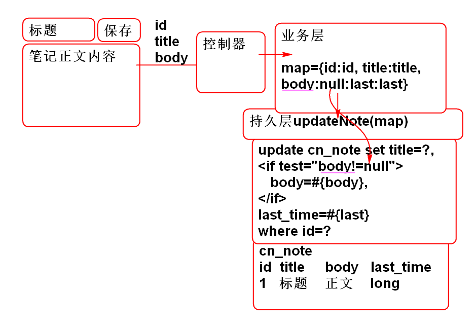

# 云笔记

## 保存笔记

利用动态SQL拼接实现保存笔记功能:

### 持久层

1. 创建持久层接口方法, NoteDao.sql:

		int updateNote(Map<String, Object> params);

2. 声明持久层SQL, NoteMapper.xml:

		<update id="updateNote"
			parameterType="map">
			update 
				cn_note
			set
				<trim suffixOverrides=",">
					<if test="userId!=null">
						cn_user_id=#{userId},
					</if>
					<if test="notebookId!=null">
						cn_notebook_id=#{notebookId},
					</if>
					<if test="statusId!=null">
						cn_note_status_id=#{statusId},
					</if>
					<if test="typeId!=null">
						cn_note_type_id=#{typeId},
					</if>
					<if test="body!=null">
						cn_note_body=#{body},
					</if>		
					<if test="title!=null">
						cn_note_title=#{title},
					</if>
					<if test="lastModifyTime!=null">
						cn_note_last_modify_time=#{lastModifyTime}
					</if>
				</trim>
			where
				cn_note_id=#{id}
		</update>
	
	> 这里的 `<if>` `<trim>` 都是MyBatis提供的动态SQL拼接标签

3. 测试NoteDaoTestCase

		@Test
		public void testUpdateNote(){
			String noteId="fed920a0-573c-46c8-ae4e-368397846efd";
			String title = "Java";
			String body = "今天学习了JavaEE";
			long now = System.currentTimeMillis();
			
			Map<String, Object> map =
				new HashMap<String, Object>();
			map.put("id", noteId);
			map.put("title", title);
			map.put("body", body);
			//map.put("lastModifyTime", now);
			
			int n = dao.updateNote(map);
			System.out.println(n); 
			//检查更新结果
			Note note=dao.findNoteById(noteId);
			System.out.println(note);
		}

### 业务层

1. 添加业务层方法, NoteService.java:

		boolean updateNote(String noteId, 
				String title, String body)
			throws NoteNotFoundException;

2. 实现业务层方法, NoteServiceImpl.java:

		public boolean updateNote(String noteId, 
				String title, String body) 
				throws NoteNotFoundException {
			if(noteId==null||noteId.trim().isEmpty()){
				throw new NoteNotFoundException("ID不能空");
			}
			Note note = noteDao.findNoteById(noteId);
			if(note==null){
				throw new NoteNotFoundException("ID错");
			}
			//创建Map, 封装更新参数
			//如 title 是 null 则不更新title
			Map<String, Object> params = 
				new HashMap<String, Object>();
			if(title!=null &&
					! title.trim().isEmpty()){
				params.put("title", title.trim());	
			}
			//笔记本内容为null, 不更新笔记内容
			if(body!=null){
				if(!body.equals(note.getBody())){
					params.put("body", body.trim());
				}
			}
			//如果title 和 body 都没有,则无需更新?
			if(params.isEmpty()){
				return false;//更新失败
			}
			//添加必须参数
			params.put("id", noteId);
			params.put("lastModifyTime", 
				System.currentTimeMillis());
			//更新数据
			int n =noteDao.updateNote(params);
			return n==1;
		}

3. 测试 NoteServiceTestCase

		@Test
		public void testUpdateNote(){
			String noteId="fed920a0-573c-46c8-ae4e-368397846efd";
			String title = "Java";
			String body = "今天学习了JavaEE";
			long now = System.currentTimeMillis();
			
			Map<String, Object> map =
				new HashMap<String, Object>();
			map.put("id", noteId);
			map.put("title", title);
			map.put("body", body);
			//map.put("lastModifyTime", now);
			
			int n = dao.updateNote(map);
			System.out.println(n); 
			//检查更新结果
			Note note=dao.findNoteById(noteId);
			System.out.println(note);
		}

### 控制器

1. 实现控制器方法 NoteController
	
		@RequestMapping("/update.do")
		@ResponseBody
		public JsonResult<Boolean> update(
				String noteId,
				String title, 
				String body){
			boolean b =noteService.updateNote(
					noteId, title, body);
			return new JsonResult<Boolean>(b);
		}

2. 测试控制器

		http://localhost:8080/note/note/update.do?noteId=fed920a0-573c-46c8-ae4e-368397846efd&title=Java123&body=JavaABCD

	> 在数据库中确认更新结果...
	
### 表现层

0. 重构 loadNoteAction方法 将笔记对象绑定到标题区域: 

		function loadNoteAction(){
			
			var li = $(this);
			var id = li.data('noteId');
			
			//设置选定笔记列表元素效果
			li.parent().find('a').removeClass('checked');
			li.find('a').addClass('checked');
			
			var url = 'note/load.do';
			var data = {noteId:id};
			
			$.getJSON(url, data, function(result){
				if(result.state==SUCCESS){
					var note=result.data;
					//绑定 note 到标题区域
					$('#input_note_title')
						.data('note', note);
					
					$('#input_note_title').val(note.title);
					um.setContent(note.body);
				}else{
					alert(result.message);
				}
			});
		}

1. 绑定保存笔记事件 edit_init.js:

		//绑定保存笔记事件
		$('#save_note').click(updateNoteAction);

2. 添加更新笔记方法 edit.js:

		//note.js
		function updateNoteAction(){
			//获取用户输入title
			//获取用户输入body
			var note = $('#input_note_title')
				.data('note');
			//提交到服务器
			var title = $('#input_note_title').val();
			var body = um.getContent();
			var data = {};
			if(title!="" && title != note.title){
				data.title=title;
			}
			if(body != note.body){
				data.body = body;
			}
			data.noteId=note.id;
			var url='note/update.do';
			$.post(url, data, function(result){
				if(result.state==SUCCESS){
					console.log("Update Success!");
					//修改客户端保存的笔记信息属性
					note.title = title;
					note.body = body;
					//找到笔记本列表中的全部笔记信息,修改其title
					//list: 包含笔记标题的全部li元素
					var list = $('#pc_part_2 ul li');
					//遍历每个li元素
					list.each(function(){
						//li 是 dom 对象, 是每个li元素
						var li = $(this);
						console.log(li);
						//取出li元素上绑定的 noteId
						var id=li.data('noteId');
						//如果当前的笔记ID与li上的笔记ID一致
						//找到当正在选定的 笔记
						if(id==note.id){
							//替换笔记的标题
							var newLi = noteTemplate
								.replace('[title]', note.title);
							newLi = $(newLi);
							//html() 用于读取或者替换li元素的内容
							li.html(newLi.html());
							//增加新选定效果
							li.find('a').addClass('checked');
						}
					});
					
				}else{
					alert(result.message);
				}
			});
		}
		
3. 测试...

## 添加笔记功能

### 持久层

1. 添加持久层方法 NoteDao.java:

		int addNote(Note note);

2. 添加SQL NoteMapper.xml:
	
		<insert id="addNote"
			parameterType="cn.tedu.note.entity.Note">
			insert into	cn_note(
				cn_note_id,
				cn_user_id,
				cn_notebook_id,
				cn_note_status_id,
				cn_note_type_id,
				cn_note_title,
				cn_note_body,
				cn_note_create_time,
				cn_note_last_modify_time
			) values (
				#{id},
				#{userId},
				#{notebookId},
				#{statusId},
				#{typeId},
				#{title},
				#{body},
				#{createTime},
				#{lastModifyTime}
			)
		</insert>

3. 测试 NoteDaoTestCase:

		@Test
		public void testAddNote(){
			String id=UUID.randomUUID().toString();
			String userId = "39295a3d-cc9b-42b4-b206-a2e7fab7e77c";
			String notebookId="6d763ac9-dca3-42d7-a2a7-a08053095c08";
			String title = "Java Note";
			String body = "Hello World!";
			long now = System.currentTimeMillis();
			
			Note note = new Note(id, notebookId, userId, 
					"0", "0", title, body, now, now);
			int n = dao.addNote(note);
			System.out.println(n); 
		}

### 业务层

1. 添加业务层方法 NoteService.java:

		Note addNote(String userId, 
			String notebookId, String title);

2. 实现业务层方法NoteServiceImpl.java

		public Note addNote(String userId,
			String notebookId, String title) {
			if(notebookId==null||notebookId.trim().isEmpty()){
				throw new NotebookNotFoundException("notebookId不能空");
			}
			Notebook book = notebookDao.findNotebookById(notebookId);
			if(book == null){
				throw new NotebookNotFoundException("notebookId不存在");
			}
			if(userId==null||userId.trim().isEmpty()){
				throw new UserNotFoundException("userId不能空");
			}
			User user = userDao.findUserById(userId);
			if(user == null){
				throw new UserNotFoundException("userId不存在");
			}
			if(title==null || title.trim().isEmpty()){
				throw new RuntimeException("title不存在");
			}
			String id = UUID.randomUUID().toString();
			title = title.trim();
			String body = "";
			String typeId="0";
			String statusId="0";
			long now = System.currentTimeMillis();
			Note note = new Note(id, notebookId, userId, statusId, typeId, title, body, now, now);
			int n = noteDao.addNote(note);
			if( n == 1){
				
				return note;
			}
			throw new RuntimeException("保存失败!");
		}

3. 测试 NoteServiceTestCase:

		@Test
		public void testAddNote(){
			String userId = "39295a3d-cc9b-42b4-b206-a2e7fab7e77c";
			String notebookId="6d763ac9-dca3-42d7-a2a7-a08053095c08";
			String title = "Java Hello";
			
			Note note = service.addNote(userId, notebookId, title);
			System.out.println(note);
		}

### 控制器

1. 控制器方法 NoteController

		@RequestMapping("/add.do")
		@ResponseBody
		public JsonResult<Note> add(
				String userId,
				String notebookId, 
				String title){
			Note note =noteService.addNote(
					userId, notebookId, title);
			return new JsonResult<Note>(note);
		}

2. 测试:

		http://localhost:8080/note/note/add.do?userId=39295a3d-cc9b-42b4-b206-a2e7fab7e77c&notebookId=6d763ac9-dca3-42d7-a2a7-a08053095c08&title=JavaEE

### 表现层

1. 重构showNotesAction, 在笔记的UL上绑定 notebookId:

		function showNotesAction(){
			var li = $(this);
			
			//设置视觉效果
			li.parent().find('a').removeClass('checked');
			li.children('a').addClass('checked');
			
			var id=li.data('notebookId');
			
			//在笔记的UL上绑定 notebookId
			var ul = $('#pc_part_2 ul');
			ul.data('notebookId', id);
			
			var url='note/list.do';
			var data={notebookId:id};
			$.getJSON(url, data, function(result){
				console.log(result);
				if(result.state==SUCCESS){
					var list = result.data;
					//显示全部的笔记
					showNotes(list);
				}else{
					alert(result.message);
				}
			});
		}

2. 绑定事件 edit_init.js:

		//绑定添加笔记按钮事件
		$('#add_note').click(openAddNoteDialog);
		//绑定添加笔记窗口中的 确定按钮事件
		$('#can').on('click', '.add-note', addNoteAction);

3. 添加打开窗口的方法 note.js:

		function openAddNoteDialog(){
			//获取当前笔记本的ID, 如果没有, 则不能打开对话框
			var ul = $('#pc_part_2 ul');
			var id = ul.data('notebookId');
			if(! id){
				alert("先选定笔记本!");
				return;
			}
			
			var url="alert/alert_note.jsp";
			$('#can').load(url);
			$('.opacity_bg').show();
		}

4. 添加保存笔记事件方法 note.js:

		function addNoteAction(){
			var title = $('#input_note').val();
			if(title=='' || title.replace(/\s/g,'')==''){
				return;
			}
			//获取当前笔记本的ID, 如果没有, 则不能向服务器发送数据
			var ul = $('#pc_part_2 ul');
			var id = ul.data('notebookId');
			if(! id){
				return;
			}
				
			var url='note/add.do';
			var data = {userId:getCookie('userId'),
					notebookId:id, title:title};
			$.post(url, data, function(result){
				console.log(result);
				if(result.state==SUCCESS){
					var note = result.data;
					//绑定note对象
					//绑定 note 到标题区域
					$('#input_note_title')
						.data('note', note);
					
					$('#input_note_title').val(note.title);
					um.setContent(note.body);
					//更新笔记列表区域
				 	var ul = $('#pc_part_2 ul');
			 		li = noteTemplate.replace(
			 	 			'[title]', note.title);
			 		li = $(li);
			 		ul.prepend(li);
			 		//更新选定效果
			 		ul.find('a').removeClass('checked');
			 		li.find('a').addClass('checked');
			 		//关闭对话框
			 		closeDialog();
				}else{
					alert(result.message);
				}
			});
			
		}

5. 测试, Good Luck!

----------------------

## 作业

1. 完成保存笔记功能
2. 完成添加笔记功能

