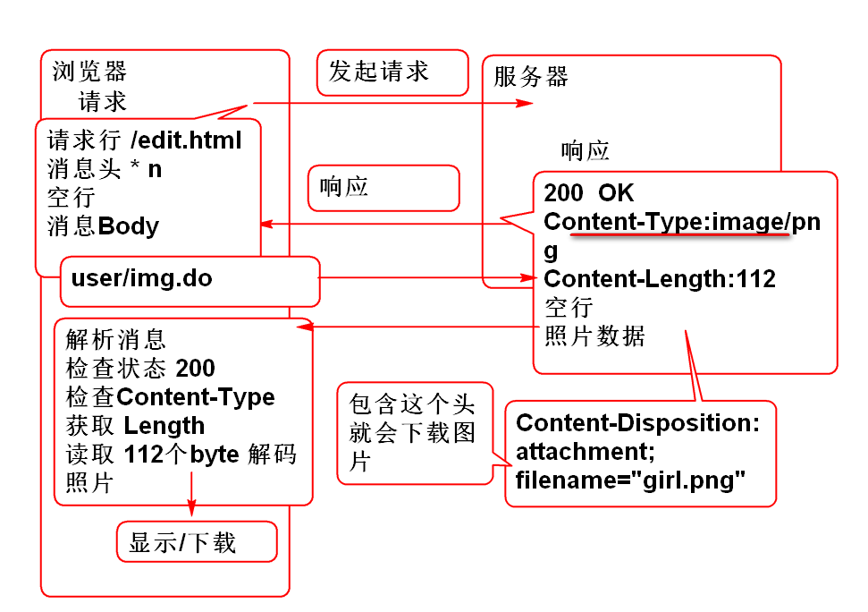

# 云笔记

## 笔记翻页功能

翻页原理：

> MySQL 查询语句利用limit子句支持了分页查询功能。

### 持久层

1. 添加持久层方法 NoteDao.java:

		List<Map<String, Object>>  findNotesByNotebookIdPaged(
			Map<String, Object> param);	

2. 声明SQL语句 NoteMapper.xml：

		<!-- map:{notebookId:id, 
					start:num, size:size} -->
		<select id="findNotesByNotebookIdPaged"
			parameterType="map" 
			resultType="map">
			select 
				cn_note_id as id,
				cn_note_title as title
			from
				cn_note
			where
				cn_notebook_id=#{notebookId}
			order by 
				cn_note_last_modify_time desc
			limit #{start}, #{size}
		</select>

3. 测试 NoteDaoTestCase：
	- 首先利用SQL找到笔记多的笔记本ID
		
			select 
				count(cn_notebook_id) ,
				cn_notebook_id
			from cn_note 
			group by cn_notebook_id
	
	- 再利用笔记本ID测试分页查询：

		@Test
		public void testFindNotesByNotebookIdPaged(){
			String notebookId="6d763ac9-dca3-42d7-a2a7-a08053095c08";
			int start = 0;
			int size = 6;
			
			Map<String, Object> map =
				new HashMap<String, Object>();
			map.put("notebookId", notebookId);
			map.put("start", start);
			map.put("size", size);
			List<Map<String, Object>> list=
				dao.findNotesByNotebookIdPaged(map);
			for (Map<String, Object> m : list) {
				System.out.println(m); 
			}
		}

### 业务层

1. 声明业务方法 NoteService

		List<Map<String, Object>> listNotes(
				String notebookId, int page)
				throws NotebookNotFoundException;

2. 实现业务方法 NoteServiceImpl

		@Transactional(readOnly=true)
		public List<Map<String, Object>> 
			listNotes(String notebookId, int page)
			throws NotebookNotFoundException {
			
			if(notebookId==null || notebookId.trim().isEmpty()){
				throw new NotebookNotFoundException("ID NULL");
			}
			Notebook book=notebookDao.findNotebookById(notebookId);
			if(book==null){
				throw new NotebookNotFoundException("ID错误");
			}
			//计算分页参数
			int size = 6;
			int start = page * size;
			//检查start是否有效
			if(start < 0){
				start = 0;
			}
			int max = 
				noteDao.countNotes(notebookId);
			if(start>=max){
				return new 
				ArrayList<Map<String,Object>>();
			}
			//拼凑参数 
			Map<String, Object> map=
				new HashMap<String, Object>();
			map.put("notebookId", notebookId);
			map.put("start", start);
			map.put("size", size);
			//分页查询
			return noteDao.findNotesByNotebookIdPaged(map);
		}

3. 重构NoteDao，添加统计方法:

		int countNotes(String notebookId);

4. 定义SQL NoteMapper.xml:

		<select id="countNotes" 
			parameterType="string"
			resultType="int">
			select 
				count(*)
			from 
				cn_note
			where 
				cn_notebook_id=#{notebookId}
		</select>

5. 测试 NoteServiceTestCase

		@Test
		public void testListNotesPaged(){
			String notebookId="6d763ac9-dca3-42d7-a2a7-a08053095c08";
			int page = 2;
			List<Map<String, Object>> list=
				service.listNotes(notebookId, page);
			for (Map<String, Object> map : list) {
				System.out.println(map);
			}
		}
	
### 控制器

1. 编写控制器方法 NoteController：

		@RequestMapping("/list2.do")
		@ResponseBody
		public JsonResult<List<Map<String, Object>>>
			list2(String notebookId, int page){
			List<Map<String, Object>> list=
				noteService.listNotes(notebookId, page);
			return new JsonResult<List<Map<String,Object>>>(list);
		}

2. 测试

		http://localhost:8080/note/note/list2.do?notebookId=6d763ac9-dca3-42d7-a2a7-a08053095c08&page=1

### 表现层

1. 重新绑定JS事件，在点击笔记本时候调用新的笔记翻页方法 edit_init.js：

		//绑定笔记本列表点击事件
		//$('#notebooks').on('click','li',showNotesAction);
		
		//绑定“翻页”笔记本列表点击事件
		$('#notebooks').on('click','li',
				showPagedNotesAction);

2. 重新绑定笔记点击事件，区别点击是笔记还是more按钮, edit_init.js：

		//绑定笔记列表点击事件
		$('#pc_part_2 ul').on('click',
				'li.note', loadNoteAction);
		//绑定more事件
		$('#pc_part_2 ul').on('click',
				'li.more', nextPageNotesAction);

3. 重构显示笔记列表方法showNotes()，支持翻页功能 edit.js:

		var noteTemplate='<li class="online note">'+
			'<a>'+
			'<i class="fa fa-file-text-o" title="online" rel="tooltip-bottom"></i>'+
			'[title]<button type="button" class="btn btn-default btn-xs btn_position btn_slide_down"><i class="fa fa-chevron-down"></i></button>'+
			'</a>'+
			'
'+
			'<dl>'+
			'	<dt><button type="button" class="btn btn-default btn-xs btn_move" title="移动至..."><i class="fa fa-random"></i></button></dt>'+
			'	<dt><button type="button" class="btn btn-default btn-xs btn_share" title="分享"><i class="fa fa-sitemap"></i></button></dt>'+
			'	<dt><button type="button" class="btn btn-default btn-xs btn_delete" title="删除"><i class="fa fa-times"></i></button></dt>'+
			'</dl>'+
			'
'+
			'</li>';
		
		function showNotes(notes, page){
			//找到UL元素
		 	var ul = $('#pc_part_2 ul');
		 	if(page==0){
		 		ul.empty();
		 	}else{
		 		ul.find('.more').remove();
		 	}
		 	//console.log(ul);
		 	for(var i=0; i<notes.length; i++){
		 		var note=notes[i];
		 		li = noteTemplate.replace(
		 			'[title]', note.title);
		 		//console.log(li);
		 		
		 		//将noteId绑定到li元素
		 		li = $(li).data('noteId', note.id);
		 		
		 		ul.append(li);
		 	}
		 	ul.append('<li class="online more"><a>More...</a></li>');
		}
	
	> 笔记模板中li class属性增加了 note
	> 显示笔记时候增加了 more 按钮

4. 添加方法响应点击笔记本事件 note.js：

		function showPagedNotesAction(){
			var li = $(this);
			var id=li.data('notebookId');
			$('#pc_part_2 ul').data('notebookId',id);
			
			nextPageNotesAction(true);
		}
		
		function nextPageNotesAction(firstPage){
			console.log('More...');
			
			//获取当前UL上绑定的笔记本ID
			var notebookId=$('#pc_part_2 ul')
				.data('notebookId');
			var page;
			if(firstPage===true){ //true
				page=0;
			}else{
				//当前页号
				page=$('#pc_part_2 ul').data('page');
			}
			//绑定下个页号
			$('#pc_part_2 ul').data('page',page+1);
			console.log(notebookId);
			//ajax 	notebookId	
			var url='note/list2.do';
			var data={notebookId:notebookId,
					page:page};
			console.log(data)
			$.getJSON(url, data, function(result){
				if(result.state==SUCCESS){
					var list=result.data;
					showNotes(list, page);
				}else{
					alert(result.message);
				}
			});
		}

> 提示：JS编码有难度，请逐步细化不断重构。

## 文件下载

HTTP协议提供了文件下载功能： RFC2616 19.5.1

> 只需要在Spring MVC 控制器中设置适当的响应头就可以实现下载文件功能

### 直接显示图片

1. 编写网页显示图片 index.html

		<h1>显示自定义照片</h1>
		
		<a href="user/img.do">显示照片</a>

2. 编写控制器，发送图片 UserController

		//produces="image/png" 用于设置 ContentType 头
		@RequestMapping(value="/img.do", 
				produces="image/png")
		@ResponseBody
		public byte[] img() throws IOException{
			//@ResponseBody 自动处理返回值
			//如果是Java Bean 处理为JSON
			//如果byte[] 就将byte数填充到返回
			//返回消息的 body中。
			//new 个照片发回去
			BufferedImage img=new BufferedImage(
				200, 56, 
				BufferedImage.TYPE_3BYTE_BGR);
			//将 img 进行编码 为 png 格式
			//FileOutputStream out = new ...;
			ByteArrayOutputStream out = 
					new ByteArrayOutputStream();
			ImageIO.write(img, "png", out);
			//拿到数组
			byte[] png=out.toByteArray();
			return png;
		}

3. 测试，在网页中点击链接可以显示图片

### 下载图片

只需要设置 Content-Disposition 头可以实现下载文件功能.

1. 编写网页 添加下载链接：
	
		<a href="user/img2.do">下载照片</a>

2. 编写控制器方法，UserController

		@RequestMapping(value="/img2.do", 
				produces="image/png")
		@ResponseBody
		public byte[] img2( 
			HttpServletResponse res)
			throws IOException {
			
			//设置 Content-Disposition 头，可以实现
			//下载文件功能，请参考 RFC2616 19.5.1章节
			// http://doc.tedu.cn/rfc/rfc2616.txt
			
			res.addHeader("Content-Disposition",
				"attachment; filename=\"girl.png\"");
			BufferedImage img=
				new BufferedImage(100, 50, 
				BufferedImage.TYPE_3BYTE_BGR);
			ByteArrayOutputStream out=
				new ByteArrayOutputStream();
			ImageIO.write(img,"png", out);
			byte[] png=out.toByteArray();
			return png;
		}

3. 测试，在网页中点击链接可以下载图片	

-----------------

## 作业

1. 实现分页显示功能
2. 实现图片下载功能

