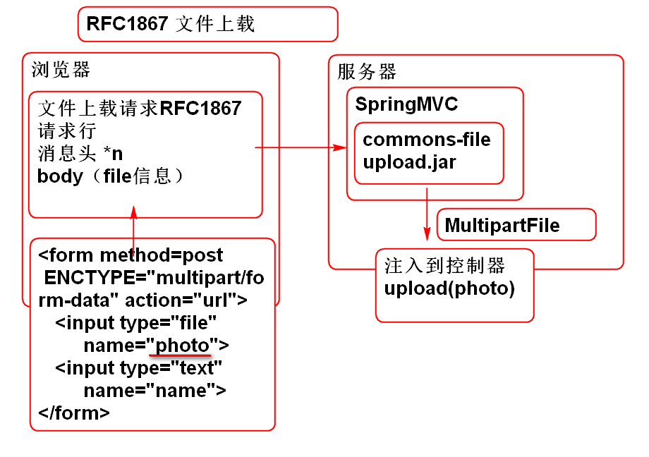
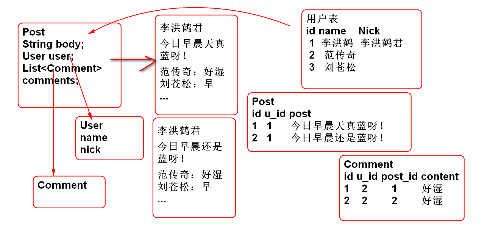
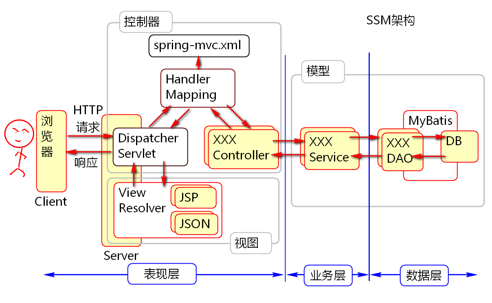

# 云笔记

## 文件下载

### Excel下载

1. 网页 添加下载链接

		<a href="download.do">下载Excel</a>

2. 导入Apache POI 包

		<dependency>
			<groupId>org.apache.poi</groupId>
			<artifactId>poi</artifactId>
			<version>3.12</version>
		</dependency>

3. 创建控制器
	- 修改Http协议头
	- POI api  生成Excel文件流（byte[]）

		@RequestMapping(value="/download.do",
				produces="application/vnd.ms-excel")
		@ResponseBody
		public byte[] download(HttpServletResponse res)
			throws IOException{
			
			res.addHeader("Content-Disposition",
					"attachment; filename=\"hello.xls\"");
			//res.setContentType("application/vnd.ms-excel");
			//创建Excel工作薄对象
			HSSFWorkbook workbook=new HSSFWorkbook();
			//在工作簿中创建工作表
			HSSFSheet sheet=workbook.createSheet();
			//创建一行
			HSSFRow row=sheet.createRow(0);//行号
			//创建一个格子
			HSSFCell cell=row.createCell(0);//列号
			//向格子填充数据
			cell.setCellValue("Hello World!");
			
			//将Excel对象序列化为 byte[]数据
			ByteArrayOutputStream out=
				new ByteArrayOutputStream();
			workbook.write(out); 
			workbook.close();
			
			byte[] buf=out.toByteArray();
			return buf;
		}

4. 测试：客户端点击下载链接，下载Excel文件

### 文件上载

文件上载标准 RFC1867 [http://doc.tedu.cn/rfc/rfc1867.txt](http://doc.tedu.cn/rfc/rfc1867.txt "RFC1867")

Spring MVC 利用 Apache commons-fileupload API 支持了文件上载

参考： [http://doc.tedu.cn/spring-framework-3.2.8/spring-framework-reference/html/mvc.html#mvc-multipart](http://doc.tedu.cn/spring-framework-3.2.8/spring-framework-reference/html/mvc.html#mvc-multipart "17.10 Spring's multipart (file upload) support")

1. 创建包含文件上载的页面 index.html
	
		<form action="user/upload.do" 
			method="post" 
			enctype="multipart/form-data">
			
			照片：<input type="file" name="photo"> 
			姓名：<input type="text" name="name"> 
			<input type="submit" value="提交">  
		
		</form>	

2. 导入上载组件

		<dependency>
		  <groupId>commons-fileupload</groupId>
		  <artifactId>commons-fileupload</artifactId>
		  <version>1.3.1</version>
		</dependency>

3. 配置Spring 文件上载解析器 spring-web.xml:

		<!-- 配置文件上载解析器组件 -->
		<bean id="multipartResolver"
			class="org.springframework.web.multipart.commons.CommonsMultipartResolver">
		    <!-- one of the properties available; the maximum file size in bytes -->
		    <property name="maxUploadSize" value="5000000"/>
		</bean>
		 
4. 编写控制器处理文件上载请求 UserController

		@RequestMapping(value="/upload.do",
				method=RequestMethod.POST)
		@ResponseBody
		public String upload(
			MultipartFile photo,
			String name) throws IOException{
			
			//MultipartFile 是Spring提供了API
			//封装了上载数据的信息：原始文件名，
			//文件的类型（mime ContentType）
			//文件的数据：byte[] 或者 输入流
			//上载时控件 name 属性的值
			
			//获取原始文件名
			String filename=
				photo.getOriginalFilename();
			//获取文件类型
			String type=
				photo.getContentType();
			//文件的数据
			byte[] data=
				photo.getBytes();
			
			File file = new File("d:/", filename);
			FileOutputStream out= 
				new FileOutputStream(file);
			out.write(data);
			out.close();
			
			return name+"Success!";
		}	

5. 用浏览器测试文件上载

### 文件上载与下载

1. 上载
	- RFC1867 协议
	- 客户端: 
		- Method=post  
		- enctype=multipart/form-data
		- input type=file
	- 服务端 SpringMVC + Apache commons-fileupload
		- 导入包，配置上载解析器
		- 控制器中注入 上载对象
2. 下载
	- HTTP1.1 RFC2616 
	- 服务端 响应头
		- ContentType=
		- ContentLength=
		- Content-Disposition=
	- 服务器 响应body
		- byte[] 数据
	- 客户端 URL连接请求
	- 利用filter或者拦截器验证权限。

## 关联查询

MyBatis提供了复杂的关联查询功能，解决复杂的对象关系：

实现关联查询

1. 建立测试数据表：

		drop table if exists p_user;
		create table p_user(
			user_id int not null auto_increment,
			user_name varchar(100),
			user_nick varchar(100),
			primary key (user_id)
		)
		insert into p_user (user_name, user_nick)
			values ('李洪鹤', '李大诗');
		insert into p_user (user_name, user_nick)
			values ('范传奇', '传奇');
		insert into p_user (user_name, user_nick)
			values ('刘苍松', '刘老师');
			
		drop table if exists p_post;
		create table p_post(
			post_id int not null auto_increment,
			user_id int,
			post_body varchar(4000),
			post_time timestamp,
			primary key (post_id)
		);
		insert into p_post
			(user_id, post_body,post_time) values 
			(1, '今天的天真的好蓝呀！', now());
		insert into p_post
			(user_id, post_body,post_time) values 
			(1, '今天的天真的好烂呀！', now());
			
		drop table if exists p_comment;
		create table p_comment(
			comment_id int not null auto_increment,
			user_id int,
			post_id int,
			comment_body varchar(4000),
			comment_time timestamp,
			primary key (comment_id)
		);
		
		insert into p_comment
			(user_id, post_id, comment_body,comment_time) values 
			(2, 1, '好湿', now());
		insert into p_comment
			(user_id, post_id, comment_body,comment_time) values 
			(3, 1, '早', now());
		insert into p_comment
			(user_id, post_id, comment_body,comment_time) values 
			(2, 2, '好湿', now());
			
2. 创建实体类：

		public class PUser implements Serializable {
			private static final long serialVersionUID = -8016188877003168896L;
			
			private Integer id;
			private String name;
			private String nick;
			
			public PUser() {
			}
		
			public PUser(String name, String nick) {
				super();
				this.name = name;
				this.nick = nick;
			}
		
			public Integer getId() {
				return id;
			}
		
			public void setId(Integer id) {
				this.id = id;
			}
		
			public String getName() {
				return name;
			}
		
			public void setName(String name) {
				this.name = name;
			}
		
			public String getNick() {
				return nick;
			}
		
			public void setNick(String nick) {
				this.nick = nick;
			}
		
			@Override
			public String toString() {
				return "PUser [id=" + id + ", name=" + name + ", nick=" + nick + "]";
			}
		
			@Override
			public int hashCode() {
				final int prime = 31;
				int result = 1;
				result = prime * result + ((id == null) ? 0 : id.hashCode());
				return result;
			}
		
			@Override
			public boolean equals(Object obj) {
				if (this == obj)
					return true;
				if (obj == null)
					return false;
				if (getClass() != obj.getClass())
					return false;
				PUser other = (PUser) obj;
				if (id == null) {
					if (other.id != null)
						return false;
				} else if (!id.equals(other.id))
					return false;
				return true;
			}
		}
		
		public class Comment implements Serializable{
			private static final long serialVersionUID = 9005740179566619541L;
			
			private Integer id;
			private Integer userId;
			private Integer postId;
			private String body;
			private Date date;
			
			public Comment() {
			}
		
			public Comment(Integer userId, Integer postId, String body, Date date) {
				super();
				this.userId = userId;
				this.postId = postId;
				this.body = body;
				this.date = date;
			}
		
			@Override
			public String toString() {
				return "Comment [id=" + id + ", userId=" + userId + ", postId=" + postId + ", body=" + body + ", date=" + date
						+ "]";
			}
		
			@Override
			public int hashCode() {
				final int prime = 31;
				int result = 1;
				result = prime * result + ((id == null) ? 0 : id.hashCode());
				return result;
			}
		
			@Override
			public boolean equals(Object obj) {
				if (this == obj)
					return true;
				if (obj == null)
					return false;
				if (getClass() != obj.getClass())
					return false;
				Comment other = (Comment) obj;
				if (id == null) {
					if (other.id != null)
						return false;
				} else if (!id.equals(other.id))
					return false;
				return true;
			}
		}
		
		public class Post implements Serializable{
			private static final long serialVersionUID = 8958411428421018244L;
		
			private Integer id;
			//发贴人
			private PUser user;
			//当前的回复
			private List<Comment> comments = 
					new ArrayList<Comment>();
			//发帖内容
			private String body;
			private Date date;
				
			public Post() {
			}
		
			public Post(Integer id, PUser user, String body, Date date) {
				super();
				this.id = id;
				this.user = user;
				this.body = body;
				this.date = date;
			}
		
			@Override
			public String toString() {
				return "Post [id=" + id + ", user=" + user + ", comments=" + comments + ", body=" + body + ", date=" + date
						+ "]";
			}
		
			@Override
			public int hashCode() {
				final int prime = 31;
				int result = 1;
				result = prime * result + ((id == null) ? 0 : id.hashCode());
				return result;
			}
		
			@Override
			public boolean equals(Object obj) {
				if (this == obj)
					return true;
				if (obj == null)
					return false;
				if (getClass() != obj.getClass())
					return false;
				Post other = (Post) obj;
				if (id == null) {
					if (other.id != null)
						return false;
				} else if (!id.equals(other.id))
					return false;
				return true;
			}
		}
		
3. 创建数据层访问接口：
		
		public interface PostDao {
			
			Post findPostById(Integer id);
			
		}

4. 声明映射文件 PostMapper.xml:

		<mapper namespace="cn.tedu.note.dao.PostDao">
			<!-- 手动映射结果集 -->
			<resultMap type="cn.tedu.note.entity.Post" 
				id="postMap">
				<!-- 映射主键 -->
				<id column="pid" property="id"/>
				<!-- 关联映射 映射User属性 -->
				<result column="body" property="body"/>
				<result column="date" property="date"/>
				<association property="user"  
					javaType="cn.tedu.note.entity.PUser">
					<!-- User 对象的属性和查询结果的映射关系 -->
					<id column="userId" property="id"/> 
					<result column="userName" property="name"/>
					<result column="userNick" property="nick"/>
				</association>
				<!-- 映射集合 List<Comment> comments 
				其中：findCommentsByPostId 是一个SQL的ID 
				column="pid" 向查询SQL传递的参数，
				pid是当前查询	的列名-->
				<collection property="comments"
					select="findCommentsByPostId"
					column="pid">
				</collection>
			</resultMap>
			<select id="findPostById"	
				parameterType="int"
				resultMap="postMap">
				select 
					post_id as pid,
					p.user_id as userId,
					u.user_name as userName,
					u.user_nick as userNick,
					post_body as body,
					post_time as date
				from 
					p_post p
				left join 
					p_user u
				on
					p.user_id = u.user_id
				where
					post_id=#{id}
			</select>
			
			<select id="findCommentsByPostId"
				parameterType="int"
				resultType="cn.tedu.note.entity.Comment">
				select 
					comment_id as id,
					user_id as userId,
					post_id as postId,
					comment_body as body,
					comment_time as date
				from 
					p_comment
				where 
					post_id = #{id}
			</select>
		</mapper>
	
	> association: 用于映射一对一，多对一关系，这里用于映射一个帖子是由一个用户发出的。
	> collection: 用于映射集合，这里表示一个帖子包含多个回复。

5. 测试：
	
		public class PostDaoTestCase 
			extends BaseTestCase{
			
			PostDao dao;
			
			@Before
			public void initDao(){
				dao = ctx.getBean(
					"postDao", PostDao.class);
			}
			
			@Test
			public void testFindPostById(){
				Post post = dao.findPostById(1);
				System.out.println(post);
			}
		}

## 云笔记项目总结

1. 项目：
	- 达内Tmooc在线的一个笔记子模块
2. 项目整体架构：3层结构 利用Spring整合
	- 表现层
		- Bootstrap+JQuery+Ajax+SpringMVC
	- 业务层
		- 业务层组件
	- 数据持久层
		- MyBatis 
	- Spring整合 SpringMVC + MyBatis 称为 SSM

	> MVC 和 3层结构是两个不同的模式，没有必然关系。

-------------

## 作业

1. 描述3层结构
1. 描述MVC模式
1. 描述SSM
1. 描述你熟悉一个云笔记功能，说明如何实现的。
1. 描述文件上载
1. 描述文件下载

